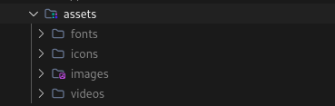
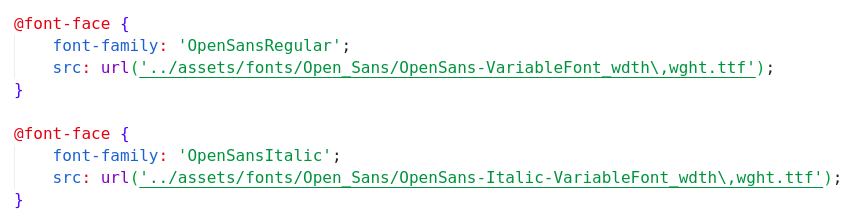

# Boas Práticas no Desenvolvimento Front-end - Um Guia Introdutório.

## Introdução
> Este material tem como objetivo fornecer um guia prático e abrangente sobre boas práticas no desenvolvimento front-end, ajudando desenvolvedores a criar aplicações web mais eficientes, manuteníveis e escaláveis.

## A importância de seguir boas práticas

- Garantir a qualidade do código e reduzir a incidência de bugs.
- Facilitar a colaboração em equipe e a integração de novos membros.
- Melhorar a performance e a acessibilidade das aplicações.
- Aumentar a satisfação do usuário com experiências mais fluidas e responsivas.

--- 

# 1. Organização de Pastas e Estrutura do Projeto

## 1.1 Pastas Principais

- **`src`**: Diretório principal contendo a maioria do código-fonte da aplicação.
- **`public`**: Pasta para arquivos estáticos acessíveis publicamente, como `index.html` e manifestos.
- **`assets`**: Local para armazenar arquivos estáticos como imagens, ícones e fontes.
- **`components`**: Contém componentes reutilizáveis da aplicação.
- **`views`**: Estrutura para páginas e seções da aplicação, geralmente representando diferentes rotas.
- **`hooks`**: Contém hooks personalizados que encapsulam lógica de estado.
- **`utils`**: Armazena funções utilitárias e helpers.

> 
> *Exemplo em Nex.js*.

## 1.2 Diferenciação entre Pastas de Lógica e Pastas de Apresentação

- **Pastas de Lógica**: Diretórios que contêm a lógica de negócios e manipulação de dados (ex: `hooks`, `services`, `context`).
- **Pastas de Apresentação**: Diretórios focados na interface do usuário (ex: `components`, `views`), onde os componentes são responsáveis pela exibição de dados.

--- 

# 2.  Organização de Componentes

## 2.1 Estrutura por Funcionalidade vs Estrutura por Tipo de Arquivo

- **Por Funcionalidade**: Agrupar componentes, estilos e testes relacionados em uma única pasta (ex: `UserProfile`, contendo `UserProfile.tsx`, `UserProfile.css`, `UserProfile.test.tsx`).
- **Por Tipo de Arquivo**: Manter uma separação mais clara entre tipos de arquivos, onde todos os componentes ficam em um diretório, todos os estilos em outro, etc.

## 2.2 Componentes Atômicos e Reutilizáveis

- **Componentes Atômicos**: Criar componentes menores e reutilizáveis, como botões e inputs, que podem ser combinados para formar componentes maiores.
- **Componentes Reutilizáveis**: Focar em criar componentes que possam ser utilizados em diferentes partes da aplicação para reduzir duplicação de código.

## 2.3 Componentes de Layout vs. Componentes de Funcionalidade

- **Componentes de Layout**: Elementos responsáveis pela estrutura e apresentação visual (ex: `Header`, `Footer`, `Sidebar`).
>
- **Componentes de Funcionalidade**: Elementos que realizam funções específicas, como formulários ou listas (ex: `UserForm`, `ProductList`).

---

# 3. Páginas e Rotas

## 3.1 Organização de Páginas no Projeto

- Agrupar páginas em um diretório dedicado (`views` ou `pages`), onde cada arquivo representa uma rota da aplicação. 
- No Next.js a partir da versão 14+ você poder organizar as páginas dentro da pasta `app`. 

## 3.2 Boas Práticas para Nomear Arquivos de Página e Rotas

- Usar nomes descritivos que refletem a função ou conteúdo da página (ex: `HomePage.tsx`, `AboutPage.tsx`).
- Utilizar kebab-case ou PascalCase para consistência.

---

# 4. Assets (Imagens, Ícones, Fonts)

## 4.1 Onde Armazenar Imagens, Ícones e Fontes

- **Imagens**: Armazenar na pasta `assets/images`.
- **Ícones**: Manter na pasta `assets/icons` ou usar bibliotecas de ícones (ex: FontAwesome).
- **Fontes**: Armazenar fontes personalizadas na pasta `assets/fonts`.
> 

## 4.2 Utilização de Fontes Externas vs. Fontes Locais

- **Fontes Externas**: Usar serviços como [Google Fonts](https://fonts.google.com/) para simplificar a inclusão e carregamento.
- **Fontes Locais**: Armazenar e usar fontes personalizadas, dentro do nosso style.css, quando necessário, garantindo o controle total sobre o estilo.
> 

---

# 5. Separação de Código por Contexto

## 5.1 Divisão de Lógica de Estado e Lógica de Dados

- **Lógica de Estado**: Usar o contexto (ex: `context`) para gerenciar estados globais e fornecer dados para componentes.
- **Lógica de Dados**: Manter serviços (ex: `services`) responsáveis por fazer requisições a APIs e manipular dados, mantendo a aplicação organizada e de fácil manutenção.

---

# 6 Boas Práticas com TypeScript

## 6.1 Configuração Inicial do TypeScript

- **Ajustes no tsconfig.json para Projetos Angular**:
    - Iniciar com um arquivo `tsconfig.json` básico e personalizá-lo conforme as necessidades do projeto.
    - **Configurações Recomendadas**:
        - `target`: Definir a versão do JavaScript que o TypeScript deve compilar (ex: `es5`, `es6`).
        - `module`: Especificar o sistema de módulos (ex: `commonjs`, `es2015`).
        - `strict`: Habilitar todas as verificações de tipo estritas para aumentar a segurança do código.
        - `baseUrl` e `paths`: Configurar caminhos para facilitar a importação de módulos.

## 6.2 Tipos e Interfaces

- **Uso de Interfaces para Definir Tipos Complexos**:
    - Criar interfaces para descrever a forma de objetos complexos, proporcionando clareza e reutilização de tipos (ex: `interface User { id: number; name: string; email: string; }`).
- **Criando Enums para Constantes e Estados**:
    - Utilizar enums para definir conjuntos nomeados de constantes, facilitando a manutenção do código e evitando valores mágicos (ex: `enum UserRole { Admin, User, Guest }`).

## 6.3 Componentes Tipados

- **Tipagem de Props e Eventos**:
    - Definir tipos para as propriedades (props) de componentes e eventos para garantir que as entradas sejam validadas (ex: `function MyComponent(props: { title: string; onClick: () => void }) { ... }`).
- **Uso de Observables e Suas Tipagens**:
    - Tipar os dados emitidos por observables em Angular, proporcionando segurança na manipulação de dados (ex: `const user$: Observable<User>`).

## 6.4 Boas Práticas de Tipagem

- **Evitar o Uso Excessivo de `any`**:
    - Sempre que possível, evitar o uso de `any`, que desabilita a verificação de tipo. Em vez disso, usar tipos mais específicos para garantir a integridade do código.
- **Tipagem de Dados de API e Respostas**:
    - Definir tipos ou interfaces para as respostas de APIs, facilitando a manipulação e a detecção de erros (ex: `interface ApiResponse { data: User[]; error?: string; }`).
